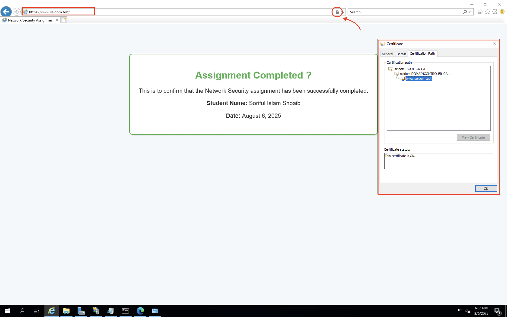
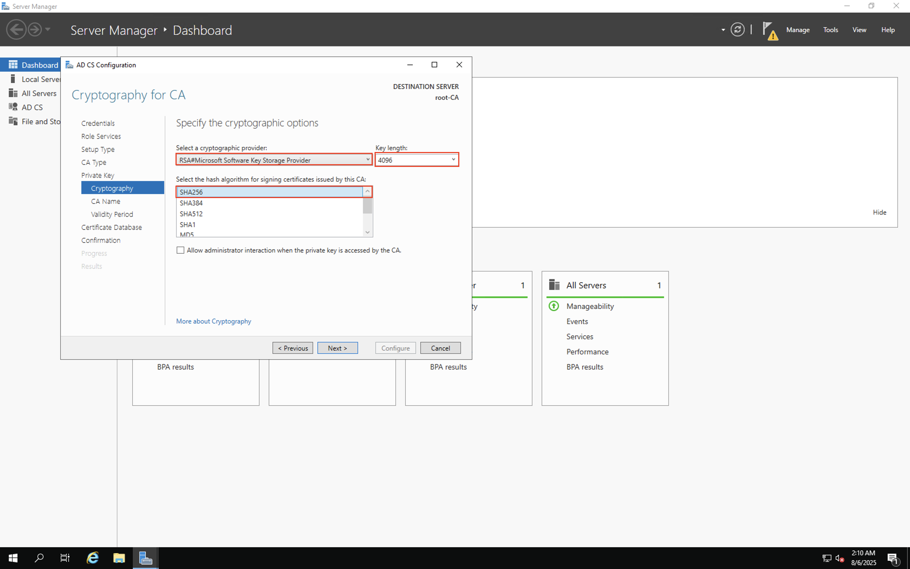
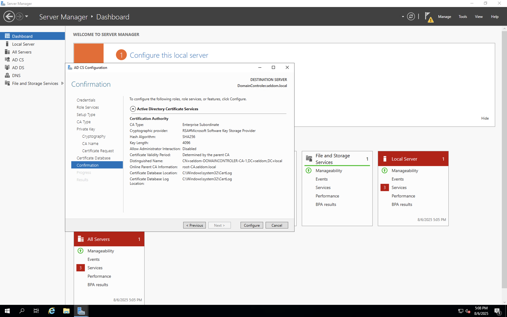
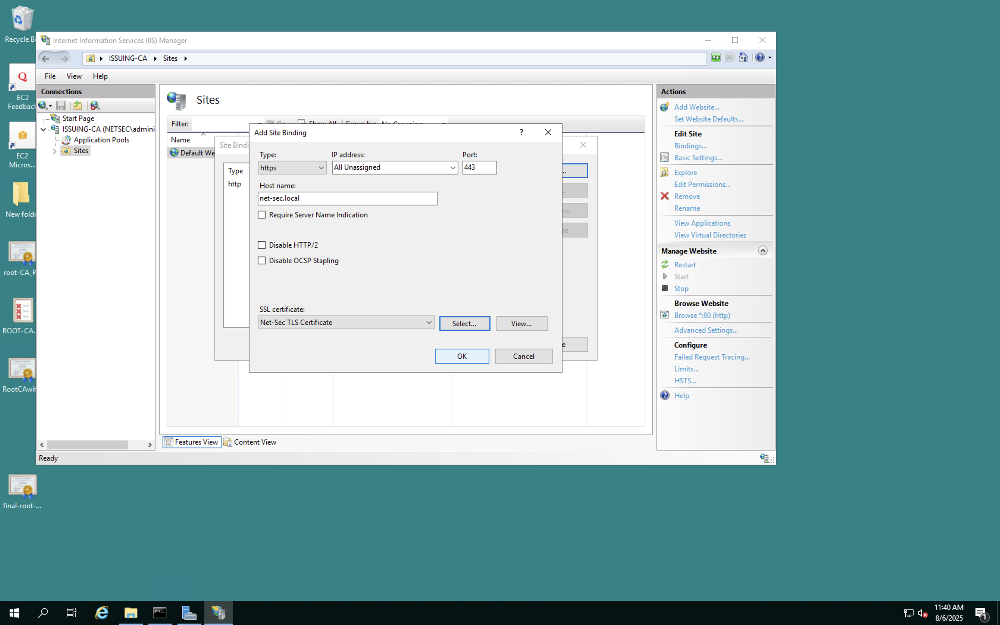

# Two-Tier PKI on Windows Server 

> MSc Cyber Security coursework: design, deploy, and threat-model a two-tier Public Key Infrastructure (PKI) on Windows Server, terminating a TLS-protected web service for a fictional organisation called **SELDOM**.

---

## What this project demonstrates

A working two-tier Microsoft PKI built end-to-end in a virtualised Windows Server environment, plus a written threat-modelling exercise focused on identity-spoofing and Certification-Authority threats. The proof that everything works is a domain-joined browser loading `https://www.seldom.test` with a valid HTTPS padlock and the full certificate chain `seldom-ROOT-CA-CA → seldom-DOMAINCONTROLER-CA-1 → www.seldom.test`.



*The end-to-end deliverable: a green-padlocked TLS page whose certificate chain validates back to the offline Root CA built in the lab.*

---

## Architecture

Two-tier Microsoft PKI hierarchy, with the catastrophic-impact key (the Root) kept off the network except during ceremony events, and the high-volume key (the Issuing CA) integrated with Active Directory for day-to-day issuance.

```
                       ┌──────────────────────────────┐
                       │   Offline Root CA            │
                       │   (Standalone, powered-off)  │
                       │   RSA 4096 / SHA-256         │
                       │   seldom-ROOT-CA-CA          │
                       └──────────────┬───────────────┘
                                      │  signs Subordinate cert
                                      ▼
                       ┌──────────────────────────────┐
                       │   Subordinate / Issuing CA   │
                       │   (Enterprise CA on the DC)  │
                       │   DomainController.seldom.local
                       │   seldom-DOMAINCONTROLER-CA-1│
                       └──────────────┬───────────────┘
                                      │  issues TLS server cert
                                      ▼
                       ┌──────────────────────────────┐
                       │   IIS Web Server             │
                       │   https://www.seldom.test    │
                       │   Bound to port 443          │
                       └──────────────────────────────┘
```

All three roles ran as virtual machines on **AWS EC2** Windows Server, with the Root CA isolated and powered off after the bootstrap key ceremony.

---

## What was built — at a glance

| Stage | What was done | Evidence |
|-------|---------------|----------|
| 1. Root CA | Installed AD CS in standalone mode, configured RSA 4096 / SHA-256, published a Certificate Revocation List (CRL), exported the self-signed root certificate | [`screenshots/01-root-ca/`](screenshots/01-root-ca/) |
| 2. Domain Controller | Promoted a fresh Windows Server to a new `seldom.local` forest with integrated DNS | [`screenshots/02-domain-controller/`](screenshots/02-domain-controller/) |
| 3. Issuing CA | Installed AD CS in Enterprise Subordinate mode, generated a CSR, had the Root CA sign it, installed the chain, started the CA | [`screenshots/03-issuing-ca/`](screenshots/03-issuing-ca/) |
| 4. Web server | Used IIS Manager → Server Certificates → Create Domain Certificate to enrol an SSL/TLS cert, bound it to HTTPS on port 443, served the proof page | [`screenshots/04-web-server/`](screenshots/04-web-server/) |
| 5. Threat model | STRIDE classification of 12 identity-spoofing and CA threats, ranked with DREAD, with a mitigation plan and ethical/legal analysis | [`threat-model/threat-model.md`](threat-model/threat-model.md) |

---

## Screenshots — key moments

### Cryptographic choices on the Root CA



*RSA 4096-bit key with SHA-256 hash chosen for the Root CA — comfortably exceeds the CA/Browser Forum Baseline Requirements minimum and gives the root a long usable lifetime.*

### Subordinate CA wired into the Root's chain of trust



*The Subordinate CA's Distinguished Name, parent CA reference, and crypto parameters at the moment of installation — the chain begins here.*

### TLS certificate bound to IIS



*The issued certificate selected for the HTTPS:443 binding on the IIS Default Web Site, completing the TLS termination configuration for SELDOM's web service.*

> For the full image gallery, browse [`/screenshots`](screenshots/). The full report `docs/SELDOM_PKI_Group_Report.docx` contains all 18 figures used in the assessment.

---

## Tech stack and tools used

| Category | What was used |
|----------|---------------|
| Hosting | AWS EC2 (Windows Server VMs) |
| Operating system | Microsoft Windows Server (Server Manager UI consistent with the 2016 / 2019 timeframe) |
| Directory / DNS | Active Directory Domain Services (`seldom.local` forest, Windows Server 2016 functional level), integrated DNS |
| PKI | Active Directory Certificate Services (AD CS) — Certification Authority + Certification Authority Web Enrollment |
| Web | Internet Information Services (IIS) — Default Web Site with HTTPS binding |
| Tooling | Server Manager, AD CS Configuration Wizard, `certsrv.msc`, Certificates MMC snap-in, IIS Manager, Certificate Import / Export Wizards |
| Cryptography | RSA 4096-bit, SHA-256, X.509, PKCS#10 (`.req`), PKCS#7 (`.p7b`) |
| Traffic inspection | Wireshark *(capture screenshot to be added — see report §2.6)* |

> Everything listed above is something that was actually used in this lab. No frameworks, languages, or tools have been added "for show".

---

## Threat-modelling summary

The full threat model lives in [`threat-model/threat-model.md`](threat-model/threat-model.md). The short version:

- **Methodology:** STRIDE for identification, DREAD for ranking — both Microsoft-origin and well-established in the literature.
- **Scope:** 12 threats covering identity spoofing (T1–T5) and Certification Authority threats (T6–T12), as required by the brief.
- **Top-ranked threats** (by DREAD mean, descending): look-alike-domain phishing (T1, 8.0), admin credential compromise (T11, 7.2), SAN-abuse / vulnerable template (T3, 7.0), rogue issuance / supply chain (T8, 6.8), Issuing CA key compromise (T7, 6.6).
- **Mitigation plan:** each threat is matched to specific controls drawn from CA/Browser Forum Baseline Requirements, NIST SP 800-57, RFC 5280, and ETSI EN 319 411-1.
- **Privacy linkage:** two significant risks (CA compromise and end-entity key theft) are discussed in detail against UK GDPR Articles 5(1)(f), 32, 33 and 34.

---

## Repository structure

```
two-tier-pki-windows-server/
├── README.md                           ← you are here
├── LICENSE                             ← see "License" section below
├── .gitignore
├── docs/
│   └── SELDOM_PKI_Group_Report.docx    ← full 4,500-word group report (the assessed deliverable)
├── threat-model/
│   └── threat-model.md                 ← STRIDE taxonomy, DREAD ranking, mitigation table (GitHub-rendered Markdown)
└── screenshots/
    ├── 01-root-ca/                     ← offline Root CA installation evidence
    ├── 02-domain-controller/           ← AD DS forest promotion evidence
    ├── 03-issuing-ca/                  ← Subordinate / Issuing CA evidence
    └── 04-web-server/                  ← IIS TLS binding and end-to-end browser proof
```

---

## How to read this repository

1. **Start with the screenshots** in the order numbered above — they tell the build story end-to-end in roughly 12 frames.
2. **Open [`threat-model/threat-model.md`](threat-model/threat-model.md)** for the STRIDE/DREAD analysis (renders natively on GitHub).
3. **Open `docs/SELDOM_PKI_Group_Report.docx`** for the full coursework submission, with academic discussion, ethical/legal analysis, and references.

---

## How to reproduce the lab

The lab is reproducible on any virtualisation platform that supports Windows Server (AWS EC2 was used; Hyper-V, VMware Workstation/ESXi, or VirtualBox would work equivalently). At a high level:

1. Provision three Windows Server VMs: `root-CA` (workgroup), `DomainController` (will host the Subordinate CA), and `webserver` (IIS).
2. Promote `DomainController` to a new forest (`seldom.local`); install DNS.
3. On `root-CA`: install AD CS as **Standalone Root CA**, RSA 4096, SHA-256; publish a CRL; export the root certificate.
4. On `DomainController`: install AD CS as **Enterprise Subordinate CA**; submit the CSR to the Root CA; install the signed chain.
5. Import the Root CA certificate into the **Trusted Root Certification Authorities** store of every relying-party machine (handled by Group Policy in production).
6. On the web server: use IIS Manager → **Server Certificates → Create Domain Certificate** to enrol a TLS cert from the Issuing CA, then add an **HTTPS** binding on port 443 for `www.seldom.test`.
7. Capture a Wireshark trace of the TLS handshake on the web-server NIC for evidence.

Step-by-step screenshots for every wizard pane are in `/screenshots`.

---

## Group project note

This was a group coursework submission under Northumbria University's LD7007 Networks Security module. This repository documents the **lead author's** contribution and serves as the public-facing portfolio version of the work. The full report attributes the group collectively as required by the brief; individual contributions are not broken out in this repository.

---

## License

> **Suggestion (requires your confirmation):** an MIT licence file is included as a default for portfolio use. If your institution requires "All rights reserved" for assessed work, or if your group decided on a different licence, replace the `LICENSE` file before publishing the repository.

---

## Clone

```bash
git clone https://github.com/<your-github-username>/two-tier-pki-windows-server.git
cd two-tier-pki-windows-server
```

> **This information has not been confirmed yet:** the `<your-github-username>` placeholder. Find-and-replace it with your real GitHub handle before pushing.

---

## Acknowledgements

- Northumbria University, MSc Cyber Security programme, LD7007 module team for the brief.
- The wider security community whose published analyses (DigiNotar post-mortem, SpecterOps "Certified Pre-Owned", Microsoft AD CS deployment guidance, RFCs 5280 / 6962 / 8446) informed the threat model. Full citations are in the report.
